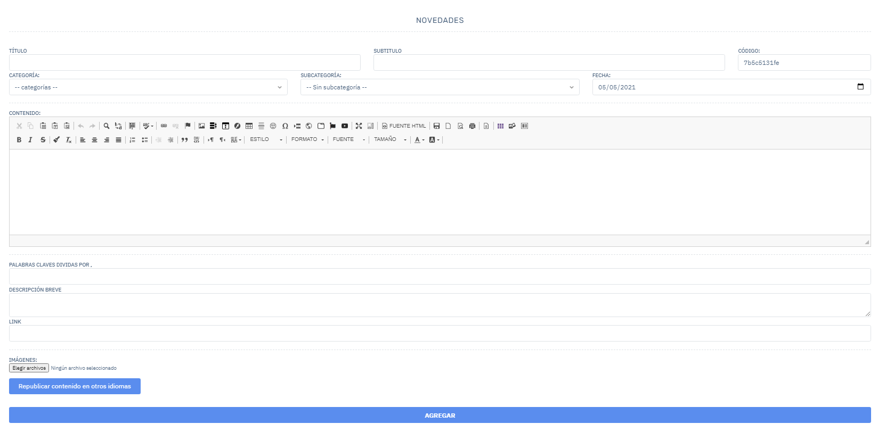
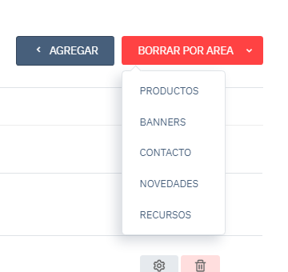
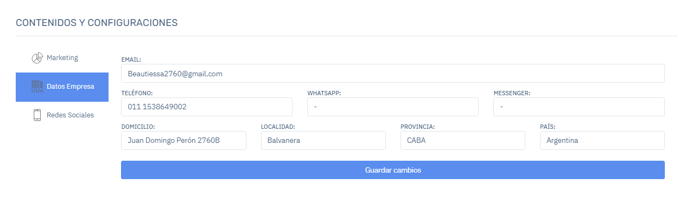

# Sistema CMS Estudio Rocha

------

## Contenidos

### Menu

Esta sección genera una barra de navegación en la pagina web la cual puede ser editada desde el administrador, tiene 7 campos:

**Titulo**: Es el nombre con el que se va a visualizar en la pagina web.

**Link**: Es la URL a la cual va a ser direccionado al hacer "click".

**Icono**: Se puede seleccionar un icono de esta pagina web externa https://fontawesome.com/v4.7.0/icons/ para que se visualice en nuestra pagina.

**Campo de selección 1**: Este selector tiene 2 opciones, "Misma Ventana" significa que al hacer click en él se va a abrir en la misma ventana, "Nueva Ventana" al hacer click va a abrir una nueva ventana en el navegador manteniendo la pagina actual.

**Campo de selección 2**: Hay una opción por defecto, la cual es "Menu Superior". Al agregar más botones va a ir listando los mismos para generar un "sub-menu" o sea opciones desplegables.

**Orden**: Es como se va a mostrar en la pagina web, de izquierda a derecha en orden ascendente.

**Selector de idioma**: En este vamos a tener el listado de los idiomas que creemos en la pagina web

### Banners

Vamos a tener un listado de los banners creados diferenciados con los distintos idiomas creados en la pagina en esta vista tiene las opciones de "[Agregar](#agregar)", "[Modificar](#modificar)", "Borrar".

#### Agregar/Modificar

-----

Las opciones de "TÍTULO MOSTRAR", "SUBTITULO MOSTRAR", "LINK MOSTRAR" son para que se visualice el titulo/subtitulo/link en la pagina web en caso de estar habilitado.

Requiere una categoría, la cual tiene que ser creada previamente.

El código se genera aleatoriamente pero en caso de querer cambiarlo debe estar simplificado sin mayúsculas y tampoco espacios "este-es-un-ejemplo".

Requiere una imagen la cual debe estar en su computadora para poder seleccionarla.

Republicar en otros idiomas es para poder duplicar este banner en los idiomas seleccionados (recomendamos republicarlo, y luego modificar a gusto dependiendo el idioma).

#### Modificar

### Áreas / Contenidos

Tiene un funcionamiento similar a una categoría, se crean áreas de los contenidos para poder separarlos dependiendo el uso que se les va a dar en [Administrar Áreas](#administrar-areas).

Por ejemplo en "Novedades" vamos a tener un listado de todas las novedades que fuimos creando para que se visualicen en la pagina web, con las opciones principales de "Agregar",  "Modificar", "Borrar" y la separación por idiomas.

#### Agregar / Modificar

Contenido:

**1.** Modificadores de texto estilo Microsoft Word.

**2-3.** Generadores de columnas y filas.

**4.** "Lightbox" Al agregar una imagen (para agregar una imagen es en el punto 7) podes  seleccionar esa imagen y cargar una imagen "oculta" que se levanta cuando haces click en la vista de esa area.

**5.** Pantalla completa del contenido.

**6.** "Iframe" 

**7.** Agregar imagen. 

Ver servidor: abre una nueva ventana en la que se pueden cargar las imágenes para después seleccionarlas, en anchura/altura se proporciona un tamaño por ejemplo "500"x"600" tambien puede ser en "%".

Vinculo: permite ingresar un link para poder redireccionar cuando hagan click en la imagen.

Cargar: permite cargar imágenes al servidor para después usarlas.

Visibilidad responsive: permite ocultar las imágenes dependiendo la resolución de la pantalla celular/tablet/pc.

### Administrar Áreas

Tenemos un listado de las áreas creadas, en el cual podemos "Agregar","Modificar","Eliminar" y esta filtrando por idioma.

#### Agregar / Modificar

Se agrega un titulo identificatorio y seguido un código "normalizado" es decir sin mayusculas, tildes/caracteres extraños y sin espacios, por ejemplo "Área de prueba -> area-de-prueba".

## Productos

-----

#### Ver Productos

Tenemos un listado con todos los productos, en el cual podemos observar un botón desplegable con un icono de "ojo" al hacerle click tenemos la opción de mostrar/ocultar las columnas para hacer mas agradable la búsqueda de un producto.

Se puede modificar el producto directamente desde la vista por ejemplo el titulo, precio, categoria, subcategoria entre otros.

La opción de "Mostrar en web" es una bandera para habilitar/deshabilitar la visibilidad del producto para los usuarios en la pagina web.

La opción de "Envio gratis" indica que ese producto no tiene costo de envio.

#### Agregar / Modificar 

Es similar a los contenidos de las áreas.

Precio Mayorista: Los usuarios que estén registrados como "mayoristas" van a ver ese precio en la pagina web;

Las palabras claves ayudan al posicionamiento del producto, tiene que ir divididas por ",".

Los datos variables son opciones que nos dan a nosotros los desarrolladores a implementar nuevas opciones para los productos.

Se pueden agregar varias imágenes.

#### Más Funcionas

-----

##### Productos Relacionados 

Vemos un listado de cada relacion que generamos de los productos, esto ayuda a generar mas ventas porque al comprar uno de estos productos levanta una ventana en la que te muestra estos productos para poder comprarlos.

Para crear una relacion necesitamos:

Un titulo identificatorio, es solo visible desde el administrador.

Para buscar los productos que se quieren relacionar se buscan por titulo, cuando comenzamos a escribir va a salir un listado de los productos que tengan ese titulo o similar y los vamos seleccionando y se posicionan en el recuadro de la derecha.

  

Se puede agregar/modificar simplemente eliminando los productos del listado y agregando más.

##### Descuentos por subcategoría

En esta sección podemos agregar una subcategoría y aplicarle un descuento en "%" por lo que todos los productos que tengan esa subcategoría se verán afectados.

##### Subir imágenes por código

Tenemos que renombrar la imagen con el código del producto al que deseamos apuntar, luego en la vista se relaciona automáticamente con el producto al que estamos apuntando.

En "administrar imágenes" podemos ver/eliminar las imágenes que ya fueron cargadas por código.

## Ecommerce

### Pedidos

---

En esta sección tenemos el registro de todas las compras realizadas en la pagina y los datos de los respectivos pedidos, como el usuario que realizó la compra, método de pago, fecha de la compra, monto, información de envio, entre otros.

Arriba tenemos una sección donde podemos filtrar por fecha, seleccionamos un rango y trae todos los pedidos dentro de ese rango.

También podemos filtrar por estados:

**Carrito no cerrado**: cunado un usuario esta en el proceso de compra y se va antes de finalizarla, queda registrado para poder concretar la venta de manera manual.

**Pendiente** , **Aprobado**, **Pago no concretado**.

### Estadísticas

----

Se muestran los 10 productos mas vendidos de la pagina

También se pueden ver los usuarios que más gastaron en la pagina

### Usuarios

-----

Tenemos un listado con todos los usuarios de la pagina, en esta podemos habilitarlos/deshabilitarlos , ver sus pedidos, agregar un pedido a ese usuario 

#### Agregar / Modificar

-----

Podemos modificar/completar los campos de el usuario

**Minorista**: Podemos seleccionar si ese usuario es minorista/mayorista.

**Activo**: Podemos habilitar/deshabilitar al usuario.

**Descuento**: Podemos agregar un descuento a ese usuario para todos los productos de la pagina.

#### Configuración

##### Estados

Podemos agregar/modificar estados de pedidos con una opción de enviar un email personalizado dependiendo el estado en que se encuentre, esto se utiliza en los métodos de pago.

##### Métodos de envio

En los métodos de envio podemos activar/desactivar ese envio, agregar un limite el cual indica que a partir de ese monto el método de envio se va a visualizar en el proceso de compra, lo mismo para el apartado del peso, podemos seleccionar que tipo de usuario va a poder seleccionarlo

 

##### Descuentos

Podemos generar códigos de descuentos para que los usuarios lo utilicen cuando finalicen la compra.

Puede ser un descuento de un "%" o un monto especifico en "$". 

Creamos un código de descuento el cual usara el usuario, el tipo de descuento y el monto que desea aplicar con ese código.

Seleccionar el tipo de usuario, y una fecha de inicio y una de vencimiento.

Podemos seleccionar a que productos aplica el descuento o a que categoria/s y subcategoria/s puede aplicar.

## Categoría / Subcategoría

Las categorías están divididas por áreas (Banners, Productos, Áreas/Contenidos), podemos crear muchas subcategorías de una sola categoría por ejemplo la categoría "Maquillaje" tiene como subcategoría "Labial", "Ojos", "Accesorios".

Podemos borrar todas las categorías de un área, si seleccionamos el área de "Productos" se borrarían todas las de productos

El código es requerido, por defecto se genera uno aleatorio.

El titulo es requerido, este se visualizará en la pagina web dependiendo del área que tenga.

El área es requerida.

La descripción y la imagen son opcional, no siempre se utiliza.

En la subcategoría lo único que cambia es que ya no tenemos área, sino que tenemos la categoría a la que queremos apuntar.

## Importar / Exportar Productos con Excel

Podemos importar o Exportar productos, tenemos que ingresar a la vista general de productos y seleccionar el botón de Importar / exportar.

Puede exportar el listado de productos en ambos idiomas en archivos separados tocando el boton "EXPORTAR PRODUCTOS".

O puede importar el listado de productos seleccionando seleccionar archivo, cargar el listado y darle a "Importar Listado" **(RECORDAR QUE NO SE DEBE ALTERAR EL ORDEN DEL LISTADO)**

## Configuración

### Contenidos y configuraciones

------

#### Marketing

En esta sección podemos ingresar los token/códigos de aplicaciones externas para que podamos vincularlas.

#### Datos de Empresa

Estos datos se usan mayormente en la parte de contacto o en el pie de pagina, si modificamos en este pestaña vamos a ver como también cambia en nuestra pagina web.

Estos datos también se ven en la pagina web por lo que si agregamos/modificamos alguna red social vamos a ver como también cambia en la pagina web.

## Administradores

Aquí podemos crear cuentas de ingreso al administrador y limitar el acceso dependiendo el área que le asignemos.

## Idiomas

En este administrador de idiomas podemos seleccionar un idioma para que sea el que se visualice por defecto en la pagina web, el usuario puede modificar cual es el idioma que él desea y queda guardado en su cuenta para que no tenga que modificarlo cada vez que entra.

Para agregar / modificar idiomas tenemos que agregar un titulo el cual se va a ver en la pagina web, y un código de área en el selector.

